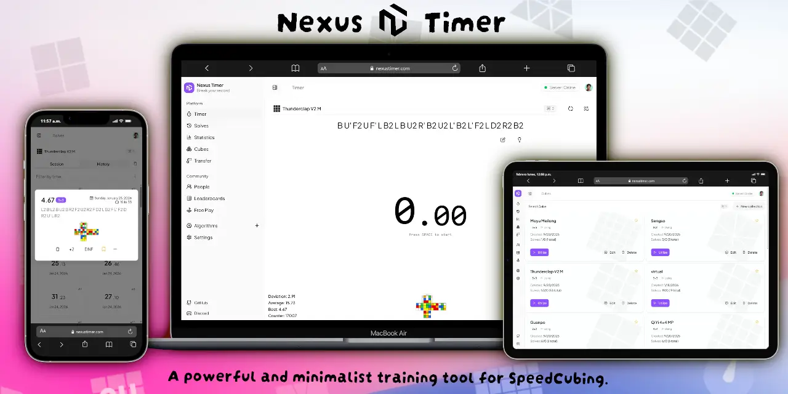

# 

  

    <strong>NexusTimer</strong> is the most advanced speedcubing manager tool designed. 
 
Implements hierarchical statistical analysis, enabling independent metrics tracking at both category and individual cube levels.
     
    <a href="https://github.com/bryanlundberg/NexusTimer/issues">Report Bug</a>
    ·
    <a href="https://github.com/bryanlundberg/NexusTimer/issues">Request Feature</a>
  

  
  
  
  
  

---

## 📖 About The Project

NexusTimer is an app designed for tracking your training sessions on the Rubik's Cube. While originally inspired
by [Twisty Timer](https://github.com/aricneto/TwistyTimer), it has evolved into a unique desktop experience with a focus
on deep analytics and a clean interface.

For those new to speedcubing, it's a challenge where cubers aim to solve the Rubik's Cube as quickly as possible.
Currently, the world record stands at **2.76 seconds** (41.65% faster than the video below
by [Feliks Zemdegs](https://www.worldcubeassociation.org/persons/2009ZEMD01) 😁).

  

---

## 📸 Screenshots

  
  
  
  

## 🌍 Languages Available

NexusTimer is available in several languages:

- 🇺🇸 English
- 🇩🇪 German
- 🇪🇸 Spanish
- 🇫🇷 French
- 🇮🇳 Hindi
- 🇯🇵 Japanese
- 🇰🇷 Korean
- 🇵🇹 Portuguese
- 🇷🇺 Russian
- 🇨🇳 Chinese

---

## 🤝 Contributing

Contributions are what make the open source community such an amazing place to learn, inspire, and create. Any
contributions you make are **greatly appreciated**.

Please read the [Contributing Guidelines](https://github.com/bryanlundberg/NexusTimer/blob/main/CONTRIBUTING.md) for
more details.

---

## 📄 License

This project is licensed under the GNU General Public License v3.0 - see
the [LICENSE](https://github.com/bryanlundberg/NexusTimer/blob/main/LICENSE) file for details.
