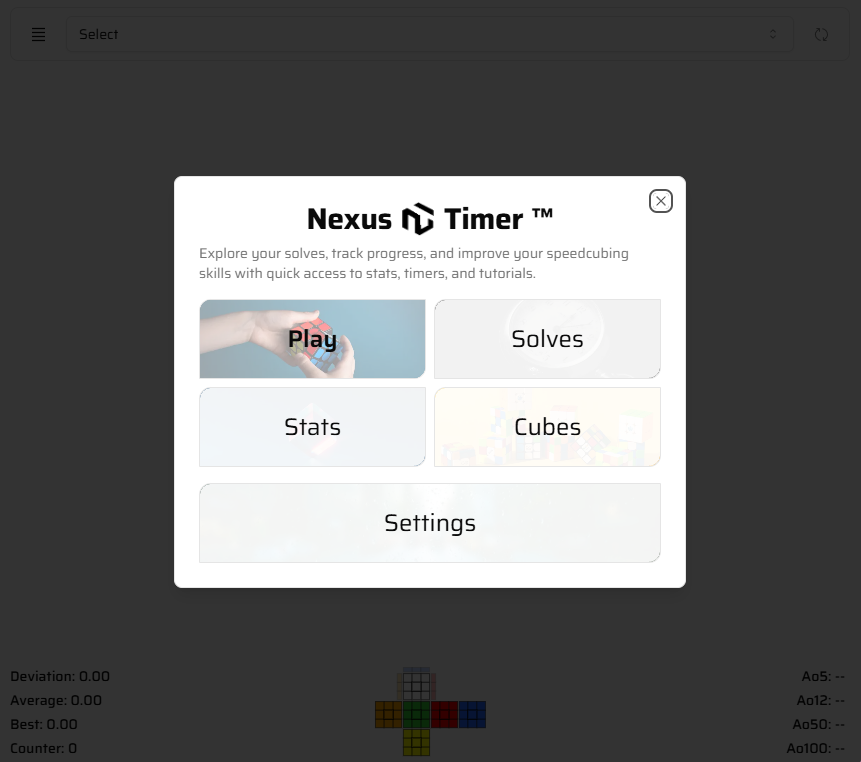
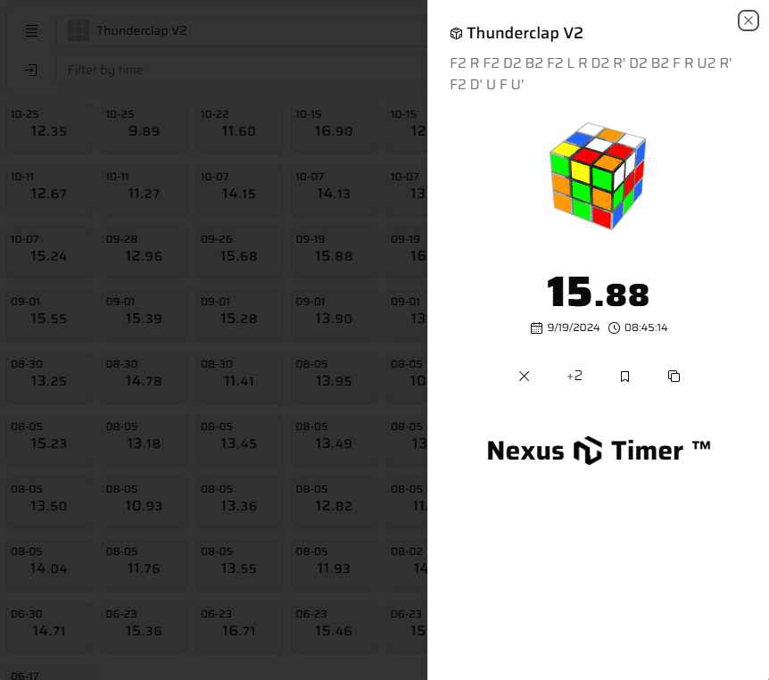
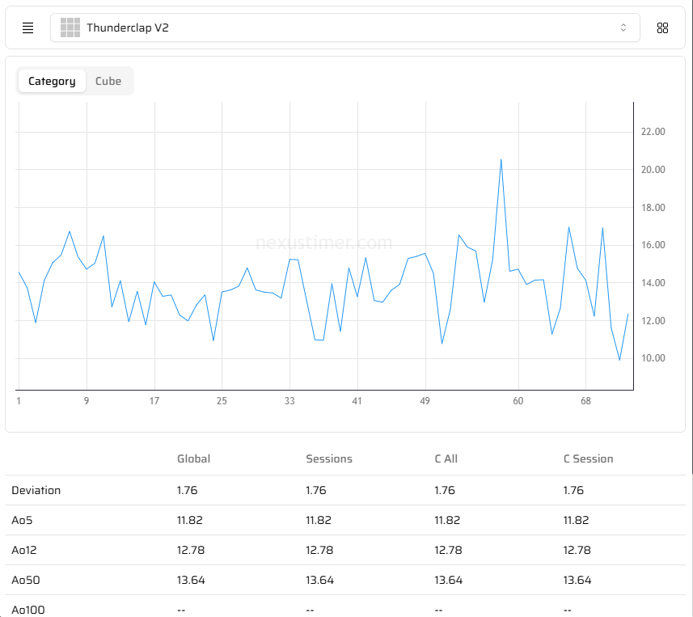
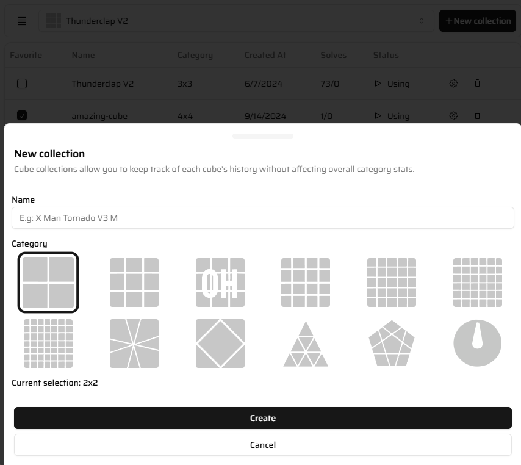
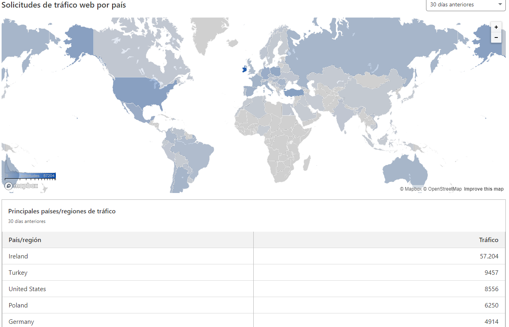

## Overview

**NexusTimer** is an app designed for tracking your training sessions on the Rubik's Cube, with a user interface inspired by [Twisty Timer](https://github.com/aricneto/TwistyTimer) to provide a comparable desktop experience.

## About The Project

For those new to speedcubing, it's a challenge where cubers aim to solve the Rubik's Cube as quickly as possible. Currently, the world record stands at 3.13 seconds (51.12% faster than the video below by [Feliks Zemdegs](https://www.worldcubeassociation.org/persons/2009ZEMD01) 😁).

  

 

  
  
  
  
  

## Screenshots

  
  
  
  

## Includes

### Metrics by cube

We have included what I called the **"Category Aggregation Principle."** allowing analyze statistics not just for individual categories but also for each individual cube within the same category without affect or modify overall calculations.

### No more DNF

Who likes? We won't cover calculations using DNF, instead delete the solve or add you a +2 penalty.

### Portability

We can detect, convert, and transfer all your previous data from timers such as csTimer, Twisty Timer, and CubeDesk!

## Languages available

- English (en)
- German (de)
- Bengali (bn)
- Czech (cs)
- Spanish (es)
- Estonian (et)
- Finnish (fi)
- French (fr)
- Hindi (hi)
- Hungarian (hu)
- Indonesian (id)
- Italian (it)
- Japanese (ja)
- Korean (ko)
- Malay (ms)
- Dutch (nl)
- Norwegian (no)
- Polish (pl)
- Portuguese (pt)
- Romanian (ro)
- Russian (ru)
- Slovak (sk)
- Swedish (sv)
- Turkish (tr)
- Ukrainian (uk)
- Vietnamese (vi)
- Chinese (zh)

"Connecting the World, One User at a Time!"

## Contributing

- If you want:
  - to **report a bug** or **suggest a change**, please open an issue.
  - to **develop new functions** or **fix a bug**, please request it in the issues section.

## Acknowledgments

I sincerely thank all contributors and tools that have made NexusTimer possible. 👌

- [cubing](https://github.com/cubing/cubing.js) for rendering cube scramble states as SVG.
- [scrambow](https://github.com/Owstin/scrambow) for generating a variety of scrambles.
- [cube-solver](https://github.com/torjusti/cube-solver) for providing cross and x-cross solutions (3x3).

## License

This project is licensed under the GNU General Public License v3.0 - see the [LICENSE](https://github.com/bryanlundberg/NexusTimer/blob/main/LICENSE) file for details.
