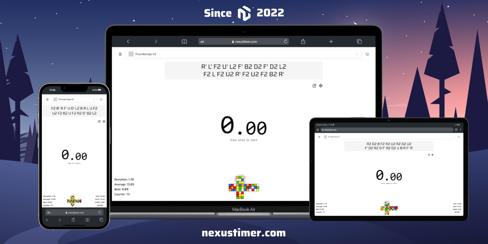
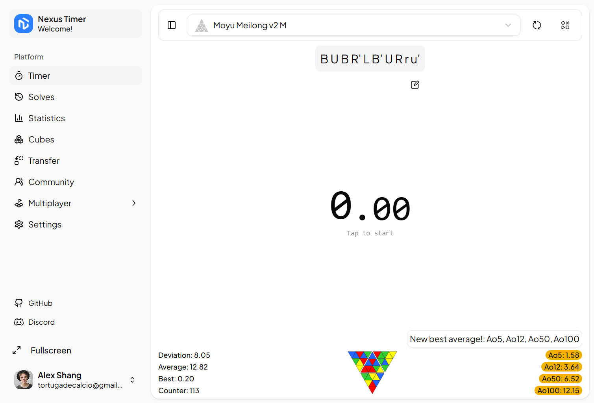
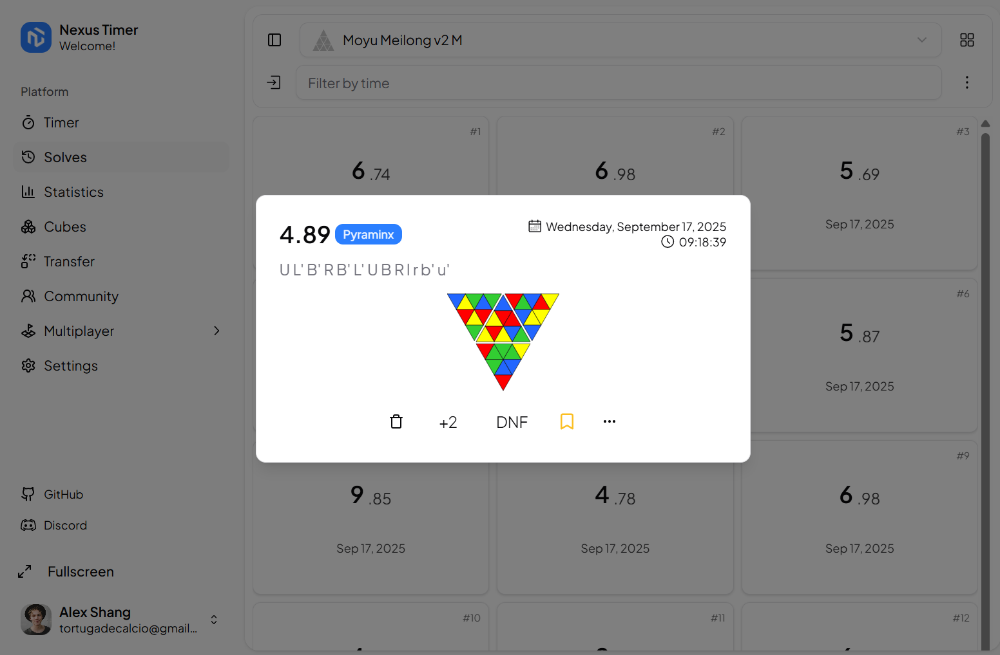
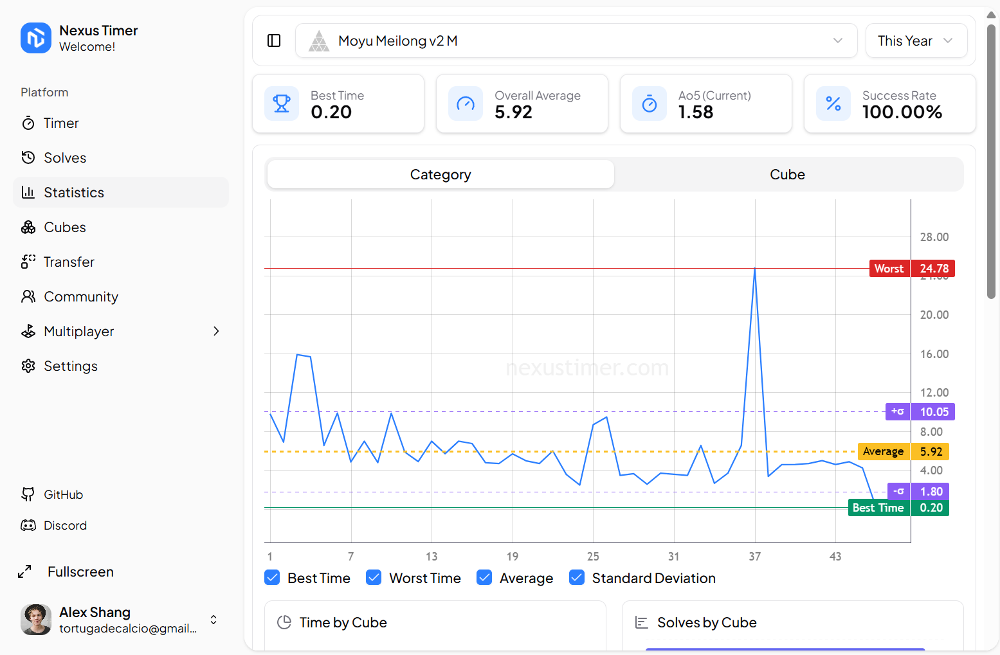
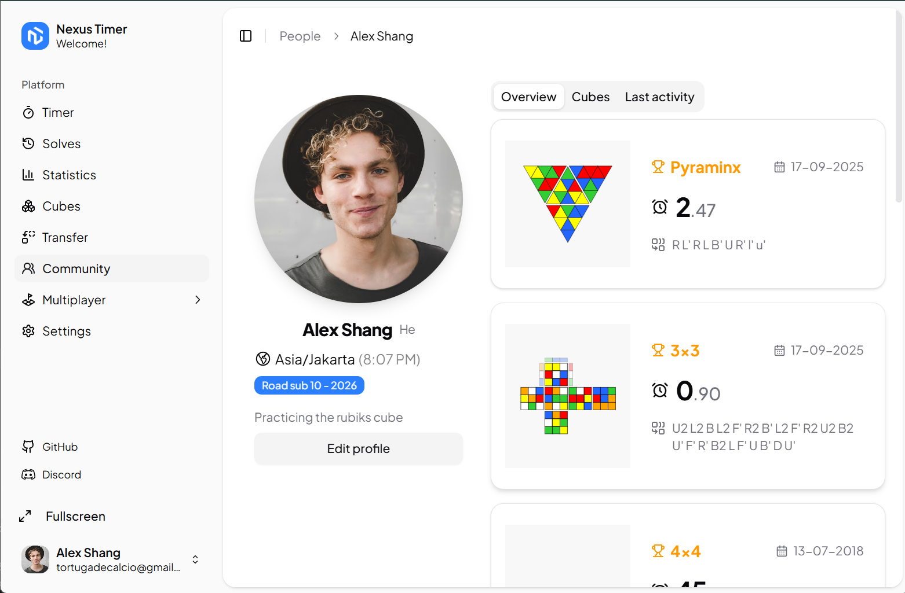

## Overview

**NexusTimer** is an app designed for tracking your training sessions on the Rubik's Cube, with a user interface inspired by [Twisty Timer](https://github.com/aricneto/TwistyTimer) to provide a comparable desktop experience.

## About The Project

For those new to speedcubing, it's a challenge where cubers aim to solve the Rubik's Cube as quickly as possible. Currently, the world record stands at 3.05 seconds (55.08% faster than the video below by [Feliks Zemdegs](https://www.worldcubeassociation.org/persons/2009ZEMD01) 😁).

  

 

  
  
  
  
  

## Screenshots

  
  
  
  

## Key Features

### Metrics by Cube

The "Category Aggregation Principle" allows you to analyze statistics not just for individual categories but also for each individual cube within the same category without affecting overall calculations.

### Comprehensive Solve Tracking

Track all your solves with detailed statistics, including DNF (Did Not Finish) tracking, penalties, and personal bests.

### Advanced Statistics

Analyze your performance with detailed statistics including averages (ao5, ao12, etc.), best times, and trends over time.

### Multiple Timer Modes

Choose between normal timer mode and Stackmat timer mode to match your preferred solving setup.

### Scramble Visualization

View scramble images to help you understand the scramble before solving, with options to zoom in for better visibility.

### Cross and X-Cross Solutions

Get hints for cross and x-cross solutions to help improve your solving techniques (for 3x3 cubes).

### Customizable Interface

Personalize your experience with features like scramble images, session statistics, quick action buttons, and more.

### Portability

Import and export your data from other popular timers such as csTimer, Twisty Timer, and CubeDesk!

## Languages available

- English (en)
- German (de)
- Bengali (bn)
- Czech (cs)
- Spanish (es)
- Estonian (et)
- Finnish (fi)
- French (fr)
- Hindi (hi)
- Hungarian (hu)
- Indonesian (id)
- Italian (it)
- Japanese (ja)
- Korean (ko)
- Malay (ms)
- Dutch (nl)
- Norwegian (no)
- Polish (pl)
- Portuguese (pt)
- Romanian (ro)
- Russian (ru)
- Slovak (sk)
- Swedish (sv)
- Turkish (tr)
- Ukrainian (uk)
- Vietnamese (vi)
- Chinese (zh)

## Contributing

- If you want:
  - to **report a bug** or **suggest a change**, please open an issue.
  - to **develop new functions** or **fix a bug**, please request it in the issues section.
  - to **translate the app** into your language, please open an issue.

If you want to **contribute code**:

1. Fork the repository.
2. Rename the `.env.local.example` file to `.env.local` (secrets are optional in case you won't code on UI sections that don't need them, most part of the working areas are not related to them).
3. Install the dependencies with `pnpm install`.
4. Run the development server with `pnpm run dev`.
5. Before submitting a pull request, ensure that your code compile by running `pnpm run build`.

### Environment and .env variables (for contributors)

| Variable                          | Description                | When do I need it?                                                                                            |
|-----------------------------------|----------------------------|---------------------------------------------------------------------------------------------------------------|
| MONGODB_URI                       | MongoDB connection string  | Save and load backups, register users, all community section                                                  |
| NEXT_PUBLIC_API_KEY               | Firebase public API key    | Clash Mode                                                                                                    |
| NEXT_PUBLIC_AUTH_DOMAIN           | Firebase auth domain       | Clash Mode                                                                                                    |
| NEXT_PUBLIC_PROJECT_ID            | Firebase project ID        | Clash Mode                                                                                                    |
| NEXT_PUBLIC_STORAGE_BUCKET        | Firebase storage bucket    | Clash Mode                                                                                                    |
| NEXT_PUBLIC_MESSAGING_SENDER_ID   | Firebase sender ID         | Clash Mode                                                                                                    |
| NEXT_PUBLIC_APP_ID                | Firebase app ID            | Clash Mode                                                                                                    |
| NEXT_PUBLIC_CLOUDINARY_CLOUD_NAME | Cloudinary cloud name      | Change user profile picture                                                                                   |
| NEXT_PUBLIC_CLOUDINARY_API_KEY    | Cloudinary public API key  | Change user profile picture                                                                                   |
| CLOUDINARY_API_SECRET             | Cloudinary API secret      | Change user profile picture                                                                                   |
| GOOGLE_CLIENT_ID                  | Google OAuth client ID     | Login/Register (normally other deeper functions require a signed-in user so you will have to add this anyway) |
| GOOGLE_CLIENT_SECRET              | Google OAuth client secret | Login/Register (normally other deeper functions require a signed-in user so you will have to add this anyway) |
| RESEND_API_KEY                    | Resend API key (emails)    | Test welcome email sending                                                                                    |
| UPSTASH_REDIS_REST_URL            | Upstash Redis REST URL     | API rate limiting (create free database at [console.upstash.com](https://console.upstash.com))                |
| UPSTASH_REDIS_REST_TOKEN          | Upstash Redis REST Token   | API rate limiting (create free database at [console.upstash.com](https://console.upstash.com))                |

GOOGLE CALLBACK/AUTH IS: http://localhost:3000/api/auth/callback/google

## Acknowledgments

I sincerely thank all contributors and tools that have made NexusTimer possible. 👌

- [cubing](https://github.com/cubing/cubing.js) for rendering cube scramble states as SVG.
- [scrambow](https://github.com/Owstin/scrambow) for generating a variety of scrambles.
- [cube-solver](https://github.com/torjusti/cube-solver) for providing cross and x-cross solutions (3x3).

## License

This project is licensed under the GNU General Public License v3.0 - see the [LICENSE](https://github.com/bryanlundberg/NexusTimer/blob/main/LICENSE) file for details.
