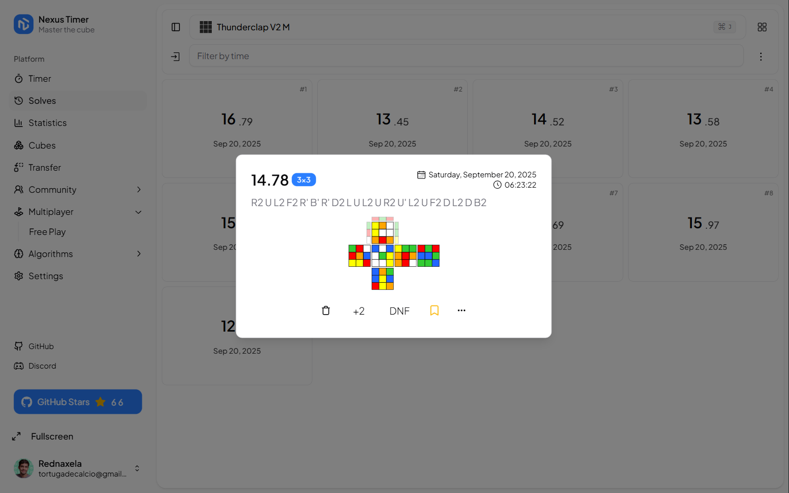
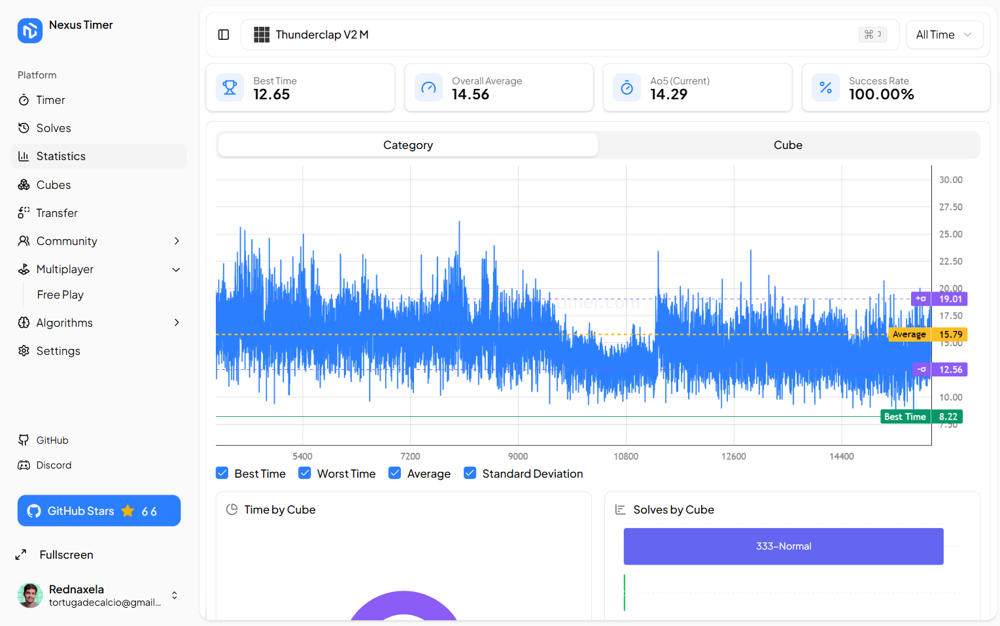

## Overview

**NexusTimer** is an app designed for tracking your training sessions on the Rubik's Cube. While originally inspired
by [Twisty Timer](https://github.com/aricneto/TwistyTimer), we have since evolved into our own unique desktop
experience.

## About The Project

For those new to speedcubing, it's a challenge where cubers aim to solve the Rubik's Cube as quickly as possible.
Currently, the world record stands at 3.05 seconds (55.08% faster than the video below
by [Feliks Zemdegs](https://www.worldcubeassociation.org/persons/2009ZEMD01) 😁).

  

 

  
  
  
  
  

## Screenshots

  
  
  
  

## Key Features

| Feature                     | Description                                                                                                                                                                                                                                |
|-----------------------------|--------------------------------------------------------------------------------------------------------------------------------------------------------------------------------------------------------------------------------------------|
| Category-Based Analytics    | Implements the proprietary "Category Aggregation Principle" algorithm for hierarchical statistical analysis, enabling independent metrics tracking at both category and individual cube levels while maintaining mathematical consistency. |
| Comprehensive Solve Metrics | Enterprise-grade solve tracking system with DNF (Did Not Finish) state management, +2 penalty handling, and automated personal best detection and validation.                                                                              |
| Statistical Engine          | Real-time statistical computation engine providing rolling averages (ao5, ao12), standard deviation analysis, and regression-based trend forecasting with customizable time windows.                                                       |
| Multi-Modal Timing System   | Dual timing architecture supporting both software-based timing and hardware Stackmat protocol integration with sub-millisecond precision.                                                                                                  |
| 3D Scramble Rendering       | Real-time 3D visualization of scramble sequences with quaternion-based cube state representation and interactive camera controls.                                                                                                          |
| Optimal Path Detection      | Advanced pathfinding algorithms for cross and x-cross solution generation, utilizing pruning tables and IDA* search for 3x3 configurations.                                                                                                |
| Data Interoperability       | Robust ETL pipeline supporting bidirectional data migration with csTimer, Twisty Timer, and CubeDesk through standardized interchange formats.                                                                                             |

## Languages available

- English (en)
- German (de)
- Bengali (bn)
- Czech (cs)
- Spanish (es)
- Estonian (et)
- Finnish (fi)
- French (fr)
- Hindi (hi)
- Hungarian (hu)
- Indonesian (id)
- Italian (it)
- Japanese (ja)
- Korean (ko)
- Malay (ms)
- Dutch (nl)
- Norwegian (no)
- Polish (pl)
- Portuguese (pt)
- Romanian (ro)
- Russian (ru)
- Slovak (sk)
- Swedish (sv)
- Turkish (tr)
- Ukrainian (uk)
- Vietnamese (vi)
- Chinese (zh)

## Contributing

Contributions are welcome! Please read
the [Contributing Guidelines](https://github.com/bryanlundberg/NexusTimer/blob/main/CONTRIBUTING.md) for more details
about the project technical setup and how to start.

## License

This project is licensed under the GNU General Public License v3.0 - see
the [LICENSE](https://github.com/bryanlundberg/NexusTimer/blob/main/LICENSE) file for details.
